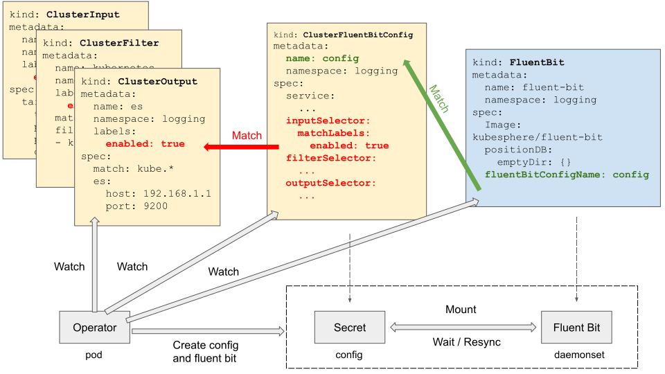
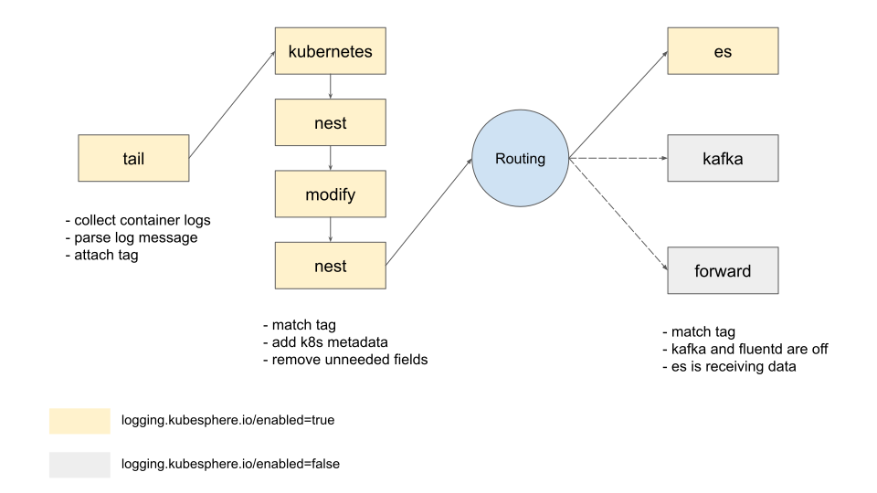

# fluent-operator配置和使用            **2738qowc**                 依赖   221qywg
## 操作实践

make install


# 测试1  【查看pod状态和CRD资源】
```sh
# 查看pod状态和CRD资源
kubectl get daemonset -A|grep fluent
kubectl get po -A|grep fluent
kubectl get FluentBit -A
kubectl get ClusterFluentBitConfig
kubectl get clusterfilter.fluentbit.fluent.io -A
kubectl get ClusterInput -A
kubectl get ClusterOutput.fluentbit.fluent.io -A

# 查看bit日志
kubectl logs fluent-bit-4hvh9 -n fluent

# 查看最终的config
kubectl -n fluent get secrets fluent-bit-config -ojson | jq '.data."fluent-bit.conf"' | awk -F '"' '{printf $2}' | base64 --decod


```


## 原链接
https://github.com/fluent/fluent-operator


---

## 架构图







